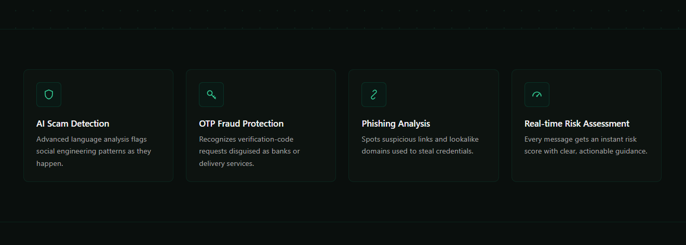
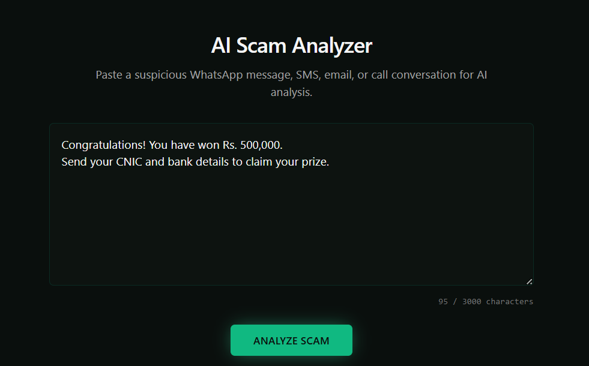
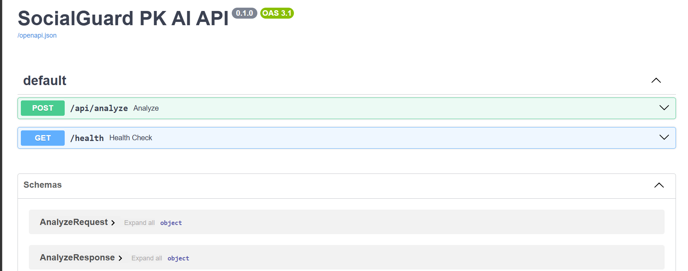

# 🛡️ SocialGuard PK AI

An AI-powered scam detection platform that helps users identify suspicious WhatsApp messages, SMS, emails, and other social engineering attacks using Google Gemini AI.

This application analyzes suspicious messages, detects scam indicators, assigns a risk score, explains the warning signs, and provides safety recommendations to protect users from cyber fraud.

---

# 🌐 Live Demo

**Frontend (Vercel)**

https://socialguard-pk-ai.vercel.app

**Backend API (Railway)**

https://socialguard-pk-ai-production.up.railway.app/docs

---

# ❓ Problem Statement

Cybercriminals frequently target people through WhatsApp, SMS, fake emails, OTP requests, phishing links, and social engineering attacks. Many users cannot easily distinguish between legitimate and fraudulent messages.

SocialGuard PK AI helps users quickly analyze suspicious messages using Artificial Intelligence and provides understandable security guidance before they become victims of scams.

---

# ✨ Features

- AI-powered scam detection
- WhatsApp scam analysis
- SMS scam detection
- Email scam detection
- Social engineering detection
- Risk Level (Low / Medium / High)
- Risk Score (0–100)
- Scam Type Identification
- Red Flag Detection
- Recommended Action
- Cyber Safety Tips
- Recent Analysis History
- Responsive Modern UI
- FastAPI REST API
- Error Handling
- Loading Animation

---

# 🤖 AI Feature

This application uses **Google Gemini AI** to analyze suspicious messages.

The AI receives a carefully designed **System Prompt** that instructs the model to behave as a cybersecurity scam analyst.

The AI analyzes user-submitted messages and returns a structured cybersecurity assessment in JSON format, including risk score, scam type, red flags, recommended actions, and safety tips.

The AI returns structured JSON containing:

- Risk Level
- Risk Score
- Scam Type
- Red Flags
- Recommended Action
- Safety Tip
- JSON-based AI response generation

### System Prompt Overview

The AI is instructed to:

- Detect phishing attempts
- Detect OTP scams
- Detect impersonation attacks
- Detect urgency tactics
- Detect social engineering
- Return structured JSON only
- Provide practical cybersecurity advice

---

# 🛠️ Technologies Used

## Frontend

- React.js
- Vite
- JavaScript
- Tailwind CSS

## Backend

- FastAPI
- Python
- Pydantic
- Uvicorn
- Google Generative AI SDK

## AI

- Google Gemini API

## Deployment

- Frontend: Vercel
- Backend: Railway

## Version Control

- Git
- GitHub

---

# 📸 Screenshots

## Home Page


---

## Home Page (Features Section)



---

## AI Scam Analyzer



---
## AI Scam Analysis Result


---

## Recent Analysis History


---

## Swagger API Documentation



---

# 🚀 How to Run Locally

## 1. Clone Repository

```bash
git clone https://github.com/zdar2004/socialguard-pk-ai.git
```

---

## 2. Backend Setup

```bash
cd backend

python -m venv venv

venv\Scripts\activate

pip install -r requirements.txt

uvicorn app.main:app --reload
```

Backend runs at

```
http://127.0.0.1:8000
```

---

## 3. Frontend Setup

```bash
cd frontend

npm install

npm run dev
```

Frontend runs at

```
http://localhost:5173
```

---

## 4. Environment Variables

Create a `.env` file inside the backend directory.

```env
GEMINI_API_KEY=YOUR_GEMINI_API_KEY
```

Create a `.env` file inside the frontend directory.

```env
VITE_API_URL=http://127.0.0.1:8000
```

---

# 📁 Project Structure

```
socialguard-pk-ai/

├── backend/
│   ├── app/
│   ├── routes/
│   ├── services/
│   ├── prompts/
│   └── main.py
│
├── frontend/
│   ├── src/
│   ├── components/
│   ├── pages/
│   └── services/
├── screenshots/
└── README.md
```

---

# 🔒 Security

- API keys are stored using environment variables.
- Sensitive credentials are excluded using `.gitignore`.
- No API secrets are committed to GitHub.

---

# 👨‍💻 Author

**Zaina Dar**

BS Computer Science Student

COMSATS University Islamabad

---

# 📜 License

This project was developed as part of the ACT AI Course Final Project.
